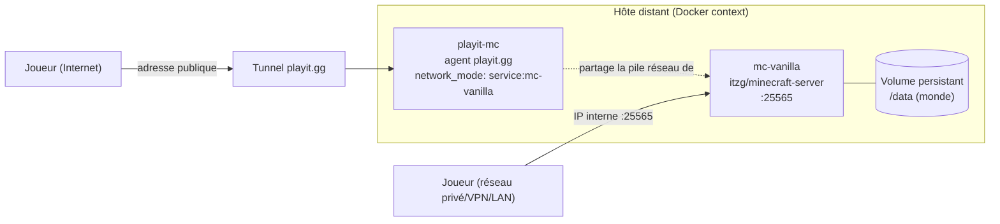

# Serveur Minecraft Java Vanilla — Docker

[](https://github.com/Alithiel31/Minecraft-Serveur/actions/workflows/ci.yml)
[](https://github.com/Alithiel31/Minecraft-Serveur/actions/workflows/smoke-test.yml)

Déploiement d'un serveur Minecraft Java vanilla via Docker Compose, avec un tunnel [playit.gg](https://playit.gg) pour l'accès public, sur un hôte distant géré via un Docker context.

## Stack & compétences

Ce projet couvre, de bout en bout :

- **Conteneurisation** : Docker Compose, gestion de `network_mode: service:`, limites mémoire (`mem_limit`), volumes persistants
- **CI/CD** : GitHub Actions (validation `docker compose config`, lint YAML/Markdown, scan de secrets avec gitleaks)
- **Sécurité opérationnelle** : externalisation des secrets (`.env`), `.gitignore`, choix whitelist/online-mode documentés
- **Diagnostic système** : analyse de crash JVM lié à la contention mémoire (`free -h`, `docker stats`), résolution DNS cassée sous namespace réseau partagé — voir [`Troubleshooting.md`](./Troubleshooting.md)
- **Documentation** : changelog versionné ([Keep a Changelog](https://keepachangelog.com/fr/1.0.0/)), procédure de déploiement et de rollback

## Architecture



Le container `playit` n'a pas d'endpoint réseau propre (`network_mode: service:mc-vanilla`) : il partage entièrement la pile réseau de `mc-vanilla`, ce qui impose un DNS statique (`resolv-playit.conf`) — voir [`Troubleshooting.md`](./Troubleshooting.md#2-le-tunnel-playitgg-reste-injoignable-dns).

## Prérequis

- Docker + Docker Compose installés sur l'hôte cible
- Un compte [playit.gg](https://playit.gg) (email vérifié) avec un agent Docker créé et un tunnel Minecraft Java configuré
- Un dossier de stockage persistant pour le monde, hors de la partition système si l'espace y est limité

## Installation

1. Copier `.env.exemple` vers `.env` et renseigner les vraies valeurs :

```bash
cp .env.exemple .env
```

Éditer `.env` :

- `PLAYIT_SECRET_KEY` : le secret généré par le wizard Docker de playit.gg (section "Agents" du dashboard)
- `MC_SEED` : la seed Minecraft souhaitée

1. Créer le dossier de données du monde (à adapter selon ton point de montage) :

```bash
mkdir -p /chemin/vers/stockage/minecraft/vanilla
```

Puis mettre à jour le chemin dans `minecraft-vanilla.yml`, section `volumes` du service `mc-vanilla`.

1. Créer le fichier `resolv-playit.conf` dans le même dossier que le compose :

```bash
cat <<RESOLVEOF > resolv-playit.conf
nameserver 1.1.1.1
nameserver 8.8.8.8
RESOLVEOF
```

> Ce fichier est nécessaire car le container `playit` partage le network namespace de `mc-vanilla` (`network_mode: service:mc-vanilla`) et ne peut pas utiliser le resolver DNS interne de Docker dans ce mode — on lui monte donc un `/etc/resolv.conf` statique pointant vers des DNS publics.

## Déploiement

```bash
docker compose -f minecraft-vanilla.yml up -d
```

## Vérifications post-lancement

```bash
# Suivre le démarrage du serveur Minecraft jusqu'au "Done" (génération du monde)
docker logs -f mc-vanilla

# Suivre la connexion de l'agent playit
docker logs -f playit-mc

# Confirmer que le DNS statique est bien appliqué au container playit
docker exec playit-mc cat /etc/resolv.conf

# Vérifier la consommation réelle des deux containers
docker stats mc-vanilla playit-mc --no-stream
```

## Accès des joueurs

- **Sur le même réseau privé que l'hôte** (VPN, LAN, Tailscale, etc.) : connexion directe sur l'IP interne de l'hôte, port `25565`.
- **Hors réseau privé** : connexion via l'adresse publique générée par le tunnel playit.gg (visible dans le dashboard, section "Tunnels" → ton tunnel Minecraft Java).

## Whitelist

Whitelist désactivée par défaut dans cette config — n'importe quel joueur avec un compte Mojang/Microsoft légitime (protection `online-mode`, activée par défaut) peut rejoindre s'il connaît l'adresse. Pour l'activer :

1. Ajouter `ENFORCE_WHITELIST: "TRUE"` dans les `environment` de `mc-vanilla`
2. Gérer les joueurs autorisés via la console (voir plus bas), avec `whitelist add <pseudo>`

## Commandes utiles

```bash
# Arrêter le serveur (sans supprimer les containers/volumes)
docker compose -f minecraft-vanilla.yml stop

# Redémarrer
docker compose -f minecraft-vanilla.yml start

# Tout arrêter et supprimer les containers (le monde reste sur le volume)
docker compose -f minecraft-vanilla.yml down

# Se connecter à la console du serveur (whitelist, op, etc.)
docker attach mc-vanilla
# Pour se détacher sans arrêter le serveur : Ctrl+P puis Ctrl+Q
```

Dans la console Minecraft :

```text
op <pseudo>                  # donner les droits admin
whitelist add <pseudo>
whitelist list
whitelist remove <pseudo>
```

## Changer la seed

Éditer `MC_SEED` dans `.env`, puis supprimer le monde existant avant de relancer (sinon la nouvelle seed est ignorée) :

```bash
rm -rf /chemin/vers/stockage/minecraft/vanilla/world
docker compose -f minecraft-vanilla.yml up -d
```

## Sauvegarde du monde

Le script [`backup.sh`](./backup.sh) archive le monde et applique une rotation (7 sauvegardes conservées par défaut) :

```bash
chmod +x backup.sh
./backup.sh /chemin/vers/stockage/minecraft ./backups 7
```

Pour l'automatiser, ajouter une entrée cron sur l'hôte (exemple : sauvegarde quotidienne à 4h) :

```cron
0 4 * * * /chemin/vers/backup.sh /chemin/vers/stockage/minecraft /chemin/vers/backups 7
```

## Sécurité

- `.env` contient des secrets et n'est **jamais** committé (voir `.gitignore`) — seul `.env.exemple` doit être versionné.
- Le serveur écoutant sans whitelist, envisager de l'activer si le tunnel public reste ouvert longtemps sans supervision active.

## Contribuer

Voir [`CONTRIBUTING.md`](./CONTRIBUTING.md) pour l'environnement de développement, la reproduction des checks CI en local et le format des PR.

## Licence

Ce projet est sous licence [MIT](./LICENSE).
