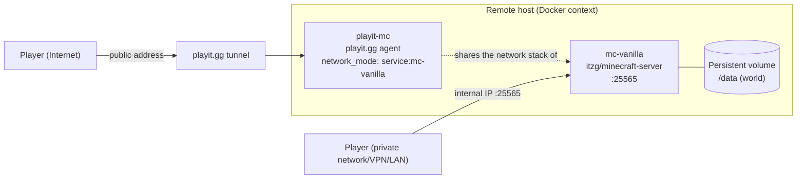

# Vanilla Minecraft Java Server — Docker

🇫🇷 [Version française](./README.fr.md)

[](https://github.com/Alithiel31/Minecraft-Serveur/actions/workflows/ci.yml)
[](https://github.com/Alithiel31/Minecraft-Serveur/actions/workflows/smoke-test.yml)

Deployment of a vanilla Minecraft Java server through Docker Compose, with a [playit.gg](https://playit.gg) tunnel for public access, on a remote host managed through a Docker context.

For anyone who wants to host a small public vanilla Minecraft server without configuring their router: Docker handles the server, playit.gg handles the public access.
Tested on a Raspberry Pi 5 (ARM64), but nothing here is Pi-specific — any Docker host works.

## Table of contents

- [Stack & skills](#stack--skills)
- [Architecture](#architecture)
- [Requirements](#requirements)
- [Installation](#installation)
- [Deployment](#deployment)
- [Post-launch checks](#post-launch-checks)
- [Player access](#player-access)
- [Whitelist](#whitelist)
- [Useful commands](#useful-commands)
- [Changing the seed](#changing-the-seed)
- [World backup](#world-backup)
- [Security](#security)
- [Contributing](#contributing)
- [License](#license)

## Stack & skills

This project covers, end to end:

- **Containerization**: Docker Compose, `network_mode: service:` handling, memory limits (`mem_limit`), persistent volumes
- **CI/CD**: GitHub Actions (`docker compose config` validation, YAML/Markdown linting, secret scanning with gitleaks)
- **Operational security**: secrets kept outside the repository (`.env`), `.gitignore`, documented whitelist/online-mode choices
- **System troubleshooting**: analysis of a JVM crash caused by memory contention (`free -h`, `docker stats`), broken DNS resolution under a shared network namespace — see [`Troubleshooting.en.md`](./Troubleshooting.en.md)
- **Documentation**: versioned changelog ([Keep a Changelog](https://keepachangelog.com/en/1.0.0/)), deployment and rollback procedure

## Architecture



The `playit` container has no network endpoint of its own (`network_mode: service:mc-vanilla`): it fully shares the network stack of `mc-vanilla`, which requires a static DNS (`resolv-playit.conf`) — see [`Troubleshooting.en.md`](./Troubleshooting.en.md#2-the-playitgg-tunnel-stays-unreachable-dns).

## Requirements

- Docker + Docker Compose installed on the target host
- A [playit.gg](https://playit.gg) account (verified email) with a Docker agent created and a Minecraft Java tunnel configured
- A persistent storage folder for the world, outside the system partition if space is limited there
- On Raspberry Pi OS, and on any host where cgroup memory accounting is off at the kernel level, Docker **silently discards** `mem_limit`. Add `cgroup_memory=1 cgroup_enable=memory` to `/boot/firmware/cmdline.txt` (`/boot/cmdline.txt` on older releases) and reboot, otherwise the memory limit in the compose file has no effect — this is what caused the crash described in [`Troubleshooting.en.md`](./Troubleshooting.en.md#1-minecraft-server-crash-watchdog-stuck-tick).

## Installation

1. Copy `.env.example` to `.env` and fill in the real values:

   ```bash
   cp .env.example .env
   ```

   Edit `.env`:

   - `PLAYIT_SECRET_KEY`: the secret generated by the playit.gg Docker wizard ("Agents" section of the dashboard)
   - `MC_SEED`: the Minecraft seed you want

2. Create the world data folder (adjust to your own mount point):

   ```bash
   mkdir -p /path/to/storage/minecraft/vanilla
   ```

   Then update the path in `minecraft-vanilla.yml`, `volumes` section of the `mc-vanilla` service.

3. Copy `resolv-playit.conf.example` to `resolv-playit.conf`, in the same folder as the compose file:

   ```bash
   cp resolv-playit.conf.example resolv-playit.conf
   ```

   > This file is required because the `playit` container shares the network namespace of `mc-vanilla` (`network_mode: service:mc-vanilla`) and cannot use Docker's internal resolver in that mode — so we mount a static `/etc/resolv.conf` pointing to public DNS servers.
   >
   > Create it **before** the first `docker compose up`: Docker does not fail on a missing bind mount source, it creates a directory with that name instead, and the `playit` container then starts without a usable resolver.

## Deployment

```bash
docker compose -f minecraft-vanilla.yml up -d
```

## Post-launch checks

```bash
# Follow the Minecraft server startup until "Done" (world generation)
docker logs -f mc-vanilla

# Follow the playit agent connection
docker logs -f playit-mc

# Confirm the static DNS is correctly applied to the playit container
docker exec playit-mc cat /etc/resolv.conf

# Check the actual resource usage of both containers
docker stats mc-vanilla playit-mc --no-stream
```

## Player access

- **On the same private network as the host** (VPN, LAN, Tailscale, etc.): direct connection to the host's internal IP, port `25565`.
- **Outside the private network**: connection through the public address generated by the playit.gg tunnel (visible in the dashboard, "Tunnels" section → your Minecraft Java tunnel).

## Whitelist

The whitelist is disabled by default in this config — any player with a legitimate Mojang/Microsoft account (`online-mode` protection, enabled by default) can join if they know the address. To enable it:

1. Add `ENFORCE_WHITELIST: "TRUE"` to the `environment` of `mc-vanilla`
2. Manage the allowed players through the console (see below), with `whitelist add <username>`

## Useful commands

```bash
# Stop the server (without removing containers/volumes)
docker compose -f minecraft-vanilla.yml stop

# Restart
docker compose -f minecraft-vanilla.yml start

# Stop everything and remove the containers (the world stays on the volume)
docker compose -f minecraft-vanilla.yml down

# Attach to the server console (whitelist, op, etc.)
docker attach mc-vanilla
# To detach without stopping the server: Ctrl+P then Ctrl+Q
```

In the Minecraft console:

```text
op <username>                # grant admin rights
whitelist add <username>
whitelist list
whitelist remove <username>
```

## Changing the seed

Edit `MC_SEED` in `.env`, then delete the existing world before restarting (otherwise the new seed is ignored):

```bash
rm -rf /path/to/storage/minecraft/vanilla/world
docker compose -f minecraft-vanilla.yml up -d
```

## World backup

The [`backup.sh`](./backup.sh) script archives the world and applies a rotation (7 backups kept by default):

```bash
chmod +x backup.sh
./backup.sh /path/to/storage/minecraft ./backups 7
```

To automate it, add a cron entry on the host (example: daily backup at 4am):

```cron
0 4 * * * /path/to/backup.sh /path/to/storage/minecraft /path/to/backups 7
```

## Security

- `.env` contains secrets and is **never** committed (see `.gitignore`) — only `.env.example` should be versioned.
- Since the server listens without a whitelist, consider enabling it if the public tunnel stays open for a long time without active supervision.

## Contributing

See [`CONTRIBUTING.md`](./CONTRIBUTING.md) for the development environment, how to reproduce the CI checks locally, and the PR format.

## License

This project is licensed under the [MIT](./LICENSE) license.
